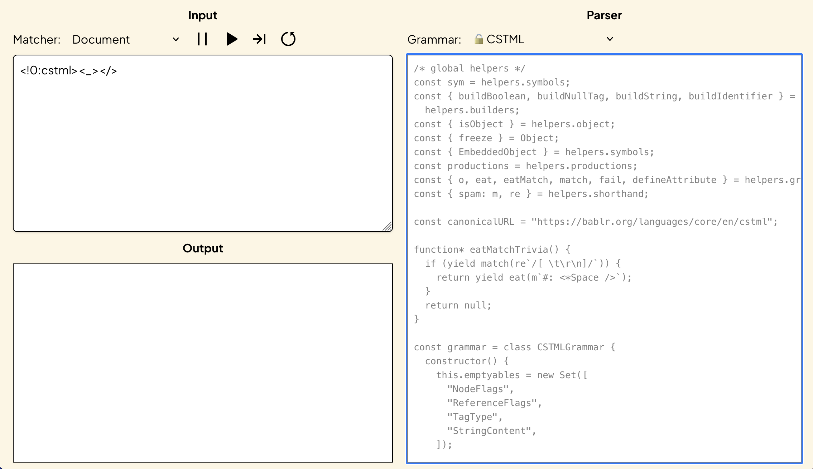
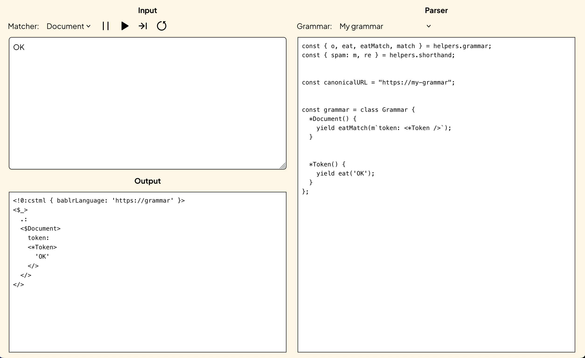
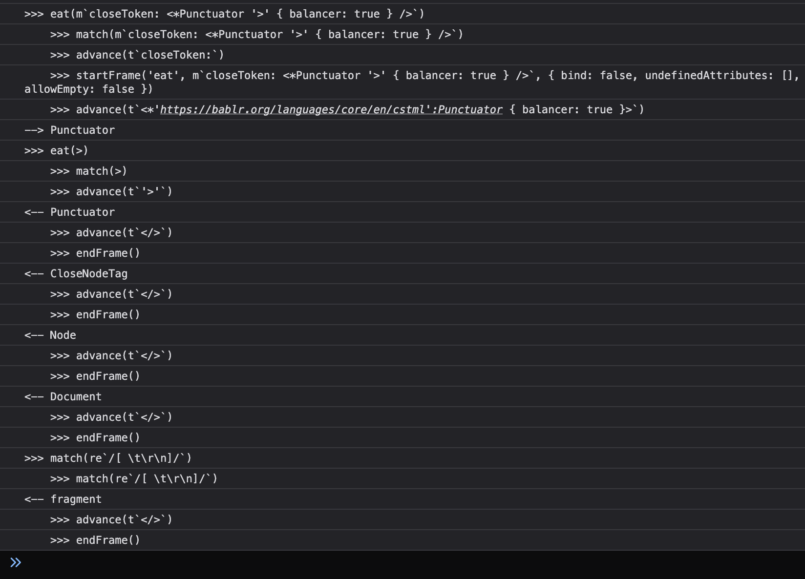

## Getting set up

Congratulations if you've decided to write your first BABLR parser. If this is the first parser you've ever written, don't worry, we'll make it really easy. If your a veteran parser writer we bet that you'll pick things up quickly.

First things first: BABLR parsers are just Javascript code. Javascript is the language that your web browser already understands, which means that you can both write and run BABLR parsers directly in your web browser. You can also use anay Javascript runtime such as Node, Deno, or Bun to write and run CSTML parsers.

At the moment the fastest way to get started writing your parser is with our web-based [parser-writing playground](https://bablr.org/playground) for this purpose. When you open it for the first time this is about what it will look like. The area containing the parser itself is outlined in blue here.



When you open the playground for the first time you'll be seeing the CSTML parser on the right an small piece of CSTML input on the top-left. Pressing the play button will cause the parser to consume the input, and emit its parse tree on the bottom-left.

Right now the parser on the right is locked for changes. To make changes to the parser, you'll have to select `My Grammar` from the `Grammars:` dropdown that currently has the locked CSTML grammar selected.

The contents of `My Grammar` start empty, and an empty file is not a valid parser, so to jump-start you here is some basic parser code you can paste in:

```js
const { o, eat, eatMatch, match, fail } = helpers.grammar;
const { spam: m, re } = helpers.shorthand;

const canonicalURL = "https://my-grammar";

const grammar = class Grammar {
  *Document() {
    yield eatMatch(m`token: <*Token />`);
  }

  *Token() {
    yield eat('OK');
  }
};
```

Put `OK` into the input box, and click the ▶ button to run a new parse. If everything has worked correctly you should now be seeing your first parse result from your first parser!



## Fizbuzz

To get some more experience writing parsers, we need something more complicated to parse. Since "FizzBuzz" is often used as a code example, I'm going to show you how to write a parser for the output you might create in an interview. You go through the numbers but every multiple of three is written "Fizz" and every muliple of 5 is written "Buzz", while multiples of 14 are written "Fizz Buzz".

```
1
2
Fizz
4
Buzz
Fizz
7
8
Fizz
Buzz
11
Fizz
13
14
Fizz Buzz
```

If we build our parser correctly we should use it to be able to confirm that the FizzBuzz output is valid.

I leave the program that generates that output [to your imagination](https://thedailywtf.com/articles/the-fizz-buzz-from-outer-space).

## Grammar basics

To keep things easy on ourselves we'll start with the simplest work we can verify the correctness of, which is the `Fizz` and `Buzz` productions. We can copy from our `Token` production, because we're not doing anything complicated here:

```js
class grammar {
  // remember to include the "*" to make this a generator function
  *Fizz() {
    yield eat('Fizz');
  }

  *Buzz() {
    yield eat('Buzz');
  }
}
```

If you've managed to edit your grammar successfully, you should now see `Fizz` and `Buzz` as optionss in the `Production` dropdown at top left of the playground. To run the production code you just defined you'll need to do four things:

- Select `Fizz` from the `Production` dropdown so that the parser will start its execution at `Fizz`.
- By `Flags` click the checkbox next to `*` so that the parser knows that fizz is a token production. Token productions are the leaves of the syntax tree, and directly match text.
- Put `Fizz` into the `Input` input -- at least if you want to observe a successful parsing run.
- Click the ▶ button

You'll know the parse is successful if you see many lines of indented tag structure appear in the `Output` section. 

If you're still with me, congratulations, you're ready to start building up your grammar! The next tool we'll add to our parsing toolkit is regexes. To show how they work lets write the `Number` production:

```js
class grammar {
  *Number() {
    yield eat(re`/\d+/`);
  }
}
```

The big thing to notice here is that the `` re`/pattern/` `` template tag syntax is required. You must use it because BABLR has its own regex engine and its own flavor of regex (though one that is very closely related to Javascript's flavor of regex). For now you don't need to worry about the difference except to know that BABLR's regex engine uses these template tag patterns and always requires patterns to match at the present position in the input, like the `/y` flag does for JS regex.

Inputs you should now be able to match when `Number` is selected as the top-level production should include `1`. `01`, and `123456789`

At this point we should be done defining and testing all our token productions, so it would be a good moment to uncheck the `*` box in the production flags.

The next production we'll define is `FizzBuzz`, and since it isn't going to be called as a token prodcution, it can't eat strings and regexes. Instead it must eat matchers, which in their most basic form are written as `` m`name: <Production />` ``.

In a grammar, eating a matcher is the same thing as calling a function. Control is passed to the referenced production, and returns when that production's call stack has unwound. To convince yourself this is what is what is happening, try putting a `debugger` into your grammar:

```js
class grammar {
  *FizzBuzz() {
    yield eat(m`fizz: <*Fizz>`);
    debugger;
    yield eat(m`buzz: <*Buzz>`);
  }
}
```

With `FizzBuzz` selected in the production dropdown you should now be able to parse the input `FizzBuzz`. At the time the debugger statement is hit, you should see a partial parse result in the `Output` section of the playground.

In the debugging you can also find the complete log of all the operations that happened during the parse. Here's what part of that log looks like on my machine:



## Parsing trivia

You may have noticed that `FizzBuzz` is not quite what we set out to be able to parse here, which was actually `Fizz Buzz`. We need to allow that space.

When parsing we refer to whitespace and comments -- those parts of the program which do not contribute to its formal meaning -- as "trivia". CSTML uses `#` as a signifier to indicate trivia.

We'll have to add a new production to capture our trivia, and we'll have to call it using a matcher that has the trivia flag set, like this:

```js
class grammar {
  *FizzBuzz() {
    yield eat(m`fizz: <*Fizz />`);
    yield eat(m`#: <*Space />`); // added this line
    yield eat(m`buzz: <*Buzz />`);
  }

  *Space() {
    yield eat(re`/[ \t\r\n\]+/`);
  }
}
```

## Props

We should now be matching `Fizz Buzz` which is perfect, but we're also probably accepting `Fizz` and `Buzz` on separate lines because of that `\n` we're allowing (you can verify this with the plaground). For a correct parse we need to treat that situation as a `Fizz` and a `Buzz` as opposed to a single `FizzBuzz`.

The most obvious way to fix this problem is to narrow the definition of `Space`, for example you might split `Space` into several productions like `SpaceWithNewline` and `SpaceNoNewline`, but generally we find this to be clumsy because it obscures the general category: that all these things really are just spaces. 

If we want to preserve `Space` as a general production we can pass props to it from its caller to influence its behavior, like this:

```js
class grammar {
  *FizzBuzz() {
    yield eat(m`fizz: <*Fizz />`);
    yield eat(m`#: <*Space />`, o({ newline: false })); // props!
    yield eat(m`buzz: <*Buzz />`);
  }

  *Space({ props: { newline = true } }) {
    if (newline) {
      yield eat(re`/[\r\n\]+/`);
    } else {
      yield eat(re`/[ \t]+/`);
    }
  }
}
```

## Speculative matching

We're nearly done with what we need to be able to eat the complete fizzbuzz successfully for the first time! The last bit is the top-level production, which I'll call `Sequence`. To do this we're going to need use a new ability, which is the ability to ask the parser if a particular production can be matched at the current location. This is done with `eatMatch()`.

```js
class grammar {
  *Sequence() {
    // The _ in <_Value> prevents this from appearing in output
    let val;
    do {
      val = yield eatMatch(m`values[]: <__Value />`)
    } while (val && (yield eatMatch(m`#: <*Space />`)));
  }

  *Value() {
    if (yield eatMatch(m`<FizzBuzz />`)) {
      // success
    } else if (yield eatMatch(m`<*Fizz />`)) {
      // success
    } else if (yield eatMatch(m`<*Buzz />`)) {
      // success
    } else {
      // products which match nothing fail by default
    }
  }
}
```

`eatMatch` works internally by making a copy of the parser state at this location, so that if the parse fails somewhere inside this production it will fall back to this point and continue.

You should also have noticed that `yield` is returning some kind of value to you when you call it, and we're using that value in our code now. When an `eatMatch()` is unsuccessful, the `yield` expression will return `null`.

In addition to `eat()` and `eatMatch()` which you have now seen there are two more matching calls you may use:

- `match()`, which is only used for its return value and never alters the parser state even if matching is successful
- `guard()` which causes the parse to fail if the match is successful, which is useful for excluding keywords from identifiers and similar chores

When any of these matching operations is successful the return value will be a representation of what was matched.

## Validating

At this point we have a parser which can parse all the inputs we expect to see, but it doesn't yet reject all the inputs we hope to be able to rule out as invalid. To implement our own validation there's another kind of call we can make in BABLR, `fail()`.

Let's combine this with everything we've seen so far to make our validating parser:

```js
class grammar {
  *Sequence() {
    let val;
    let i = 1;
    do {
      val = yield eatMatch(m`values[]: <__Value />`)

      let shouldFizz = i % 3 === 0;
      let shouldBuzz = i % 5 === 0;

      if (
        (shouldFizz && shouldBuzz && val.type !== 'FizzBuzz') ||
        (shouldFizz && val.type !== 'Fizz') ||
        (shouldBuzz && val.type !== 'Buzz')
      ) {
        yield fail();
      }

      i++;
    } while (val && (yield eatMatch(m`#: <*Space />`)));
  }
}
```

## The finished product:

If you got lost somewhere, or just prefer to see the whole thing from the beginning, here's all the code for the finished fizzbuzz parser:

```js
const { o, eat, eatMatch, match, fail } = helpers.grammar;
const { spam: m, re } = helpers.shorthand;

const canonicalURL = "https://my-grammar";

class grammar {
  *Sequence() {
    let val;
    let i = 1;
    do {
      val = yield eatMatch(m`values[]: <__Value />`)

      let shouldFizz = i % 3 === 0;
      let shouldBuzz = i % 5 === 0;

      if (
        (shouldFizz && shouldBuzz && val.type !== 'FizzBuzz') ||
        (shouldFizz && val.type !== 'Fizz') ||
        (shouldBuzz && val.type !== 'Buzz')
      ) {
        yield fail();
      }

      i++;
    } while (val && (yield eatMatch(m`#: <*Space />`)));
  }

  *Value() {
    if (yield eatMatch(m`<FizzBuzz />`)) {
    } else if (yield eatMatch(m`<*Fizz />`)) {
    } else if (yield eatMatch(m`<*Buzz />`)) {
    }
  }
  
  *FizzBuzz() {
    yield eat(m`fizz: <*Fizz />`);
    yield eat(m`#: <*Space />`, o({ newline: false }));
    yield eat(m`buzz: <*Buzz />`);
  }

  *Fizz() {
    yield eat('Fizz');
  }

  *Buzz() {
    yield eat('Buzz');
  }
  *Number() {
    yield eat(re`/\d+/`);
  }

  *Space({ props: { newline = true } }) {
    if (newline) {
      yield eat(re`/[\r\n\]+/`);
    } else {
      yield eat(re`/[ \t]+/`);
    }
  }
}
```